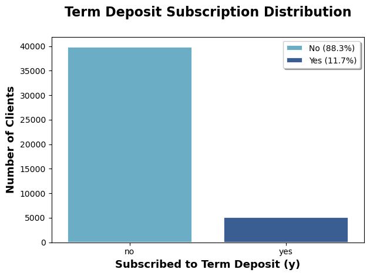
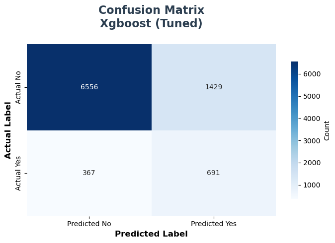
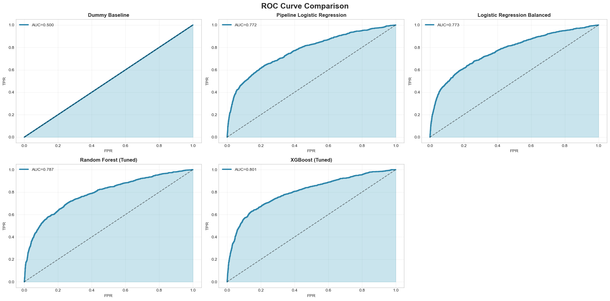
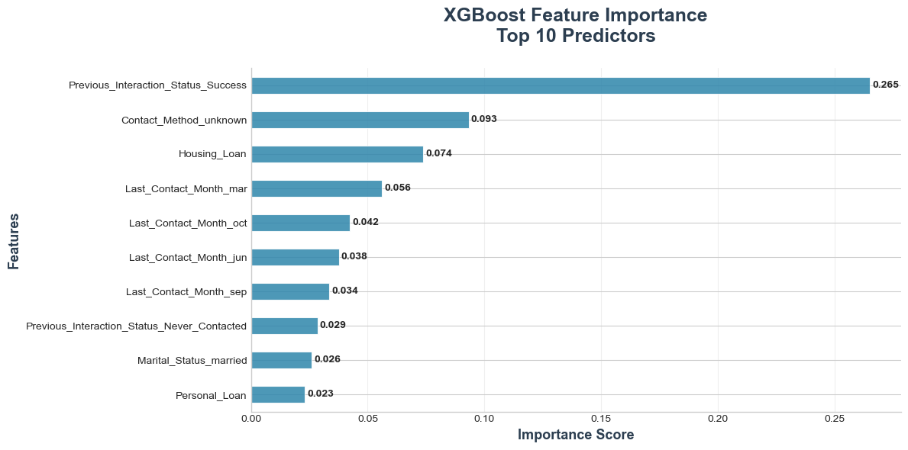

# Bank Marketing Prediction

## Project Overview

This project develops and evaluates machine learning models to predict whether a bank client is likely to subscribe to a term deposit during a direct marketing campaign.

The main goal is to support better customer targeting by helping marketing teams identify clients with a higher probability of accepting the offer.

## Business Problem

Banks often contact a large number of customers during marketing campaigns without knowing in advance who is most likely to subscribe. This can lead to inefficient use of time, resources, and operational effort.

This project applies predictive analytics to improve campaign targeting and support data-driven decision-making.

## Dataset

The project uses the Bank Marketing dataset from the UCI Machine Learning Repository. The dataset contains customer demographic information, financial attributes, campaign contact details, previous campaign outcomes, and the final subscription result.

The analysis used 45,211 observations and treated term deposit subscription as a binary classification problem.

## Tools and Technologies

* Python
* Pandas
* NumPy
* Scikit-learn
* XGBoost
* Matplotlib
* Seaborn
* Excel
* Jupyter Notebook

## Methodology

The project followed a structured analytics workflow:

1. Data loading and initial inspection
2. Data quality audit
3. Exploratory data analysis
4. Class imbalance analysis
5. Feature engineering
6. Data preprocessing
7. Train/test split
8. Model training and comparison
9. Model evaluation
10. Business interpretation

## Models Compared

The following models were evaluated:

* Dummy Classifier
* Logistic Regression
* Balanced Logistic Regression
* Random Forest
* XGBoost

## Key Results

The final recommended model was XGBoost because it provided the best overall balance between recall, F1-score, and ROC-AUC.

Final XGBoost performance:

* Accuracy: 0.8014
* Precision: 0.3259
* Recall: 0.6531
* F1-score: 0.4349
* ROC-AUC: 0.8010

Since the dataset was imbalanced, accuracy alone was not considered sufficient. Recall was prioritized because missing potential subscribers represents a lost business opportunity.

## Key Business Insights

The model can help marketing teams prioritize customers who are more likely to subscribe to a term deposit. This can reduce unnecessary customer contact, improve campaign efficiency, and support better resource allocation.

The most influential predictive factors included previous successful customer interaction, contact method information, and housing loan status.

## Visualizations

### Target Variable Distribution



### XGBoost Confusion Matrix



### ROC Curve Comparison



### XGBoost Feature Importance



## Project Files

- [Jupyter Notebook](notebooks/bank_marketing_analysis.ipynb)
- [Final Report](report/final_report_predictive.pdf)

## Repository Structure

```text
bank-marketing-prediction/
│
├── README.md
├── notebooks/
│   └── bank_marketing_analysis.ipynb
│
├── report/
│   └── bank_marketing_report.pdf
│
└── images/
    ├── target_distribution.png
    ├── confusion_matrix_xgboost.png
    ├── roc_curve_comparison.png
    └── xgboost_feature_importance.png

```

## Author

**Luis Enrique Villalobos Socualaya**  
Master of Data Analytics Student  
University of Niagara Falls Canada  
[LinkedIn](https://www.linkedin.com/in/luisvillaloboss/)
